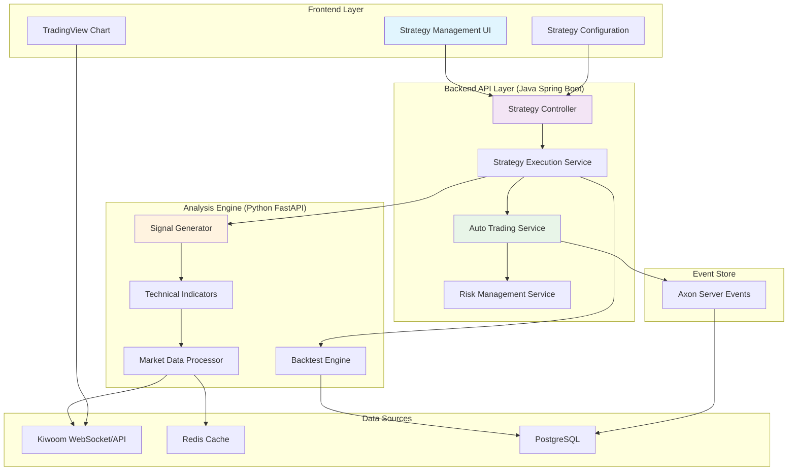
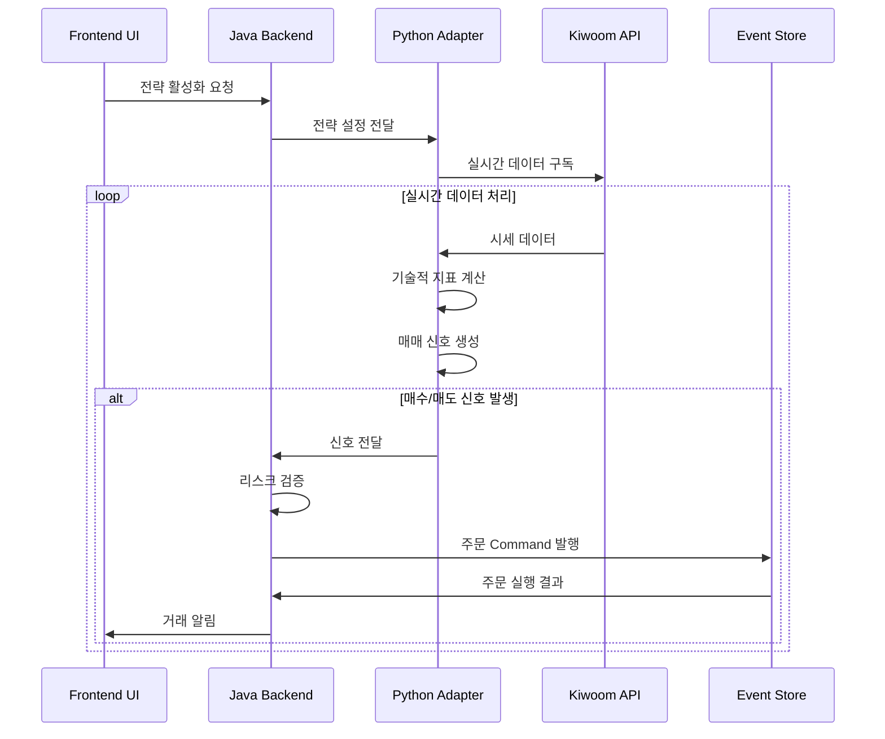
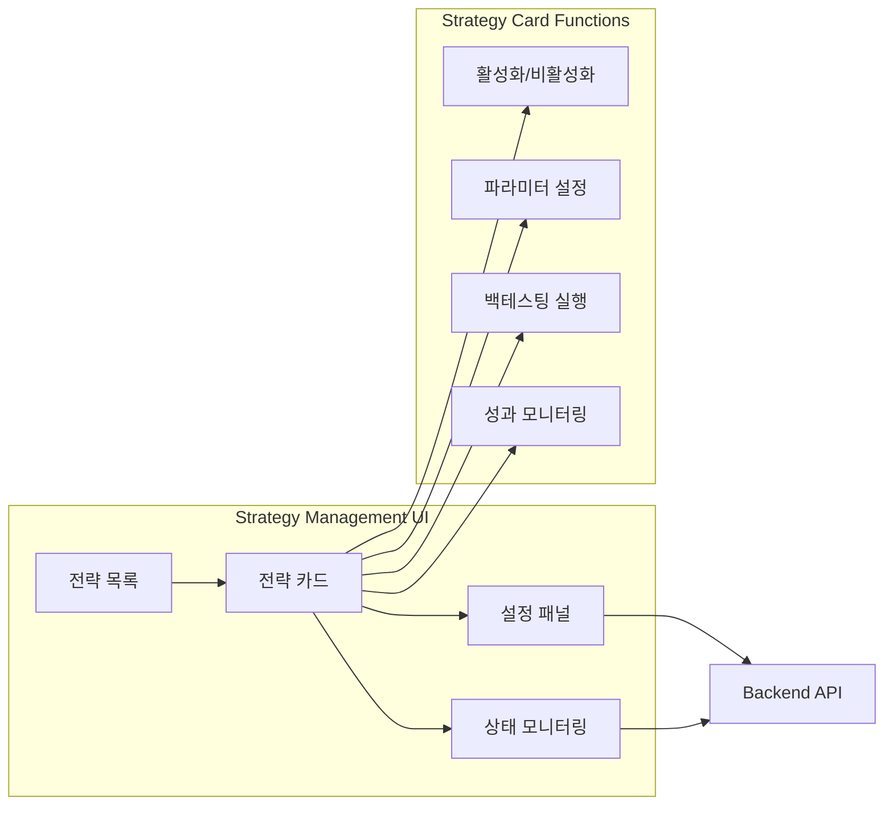
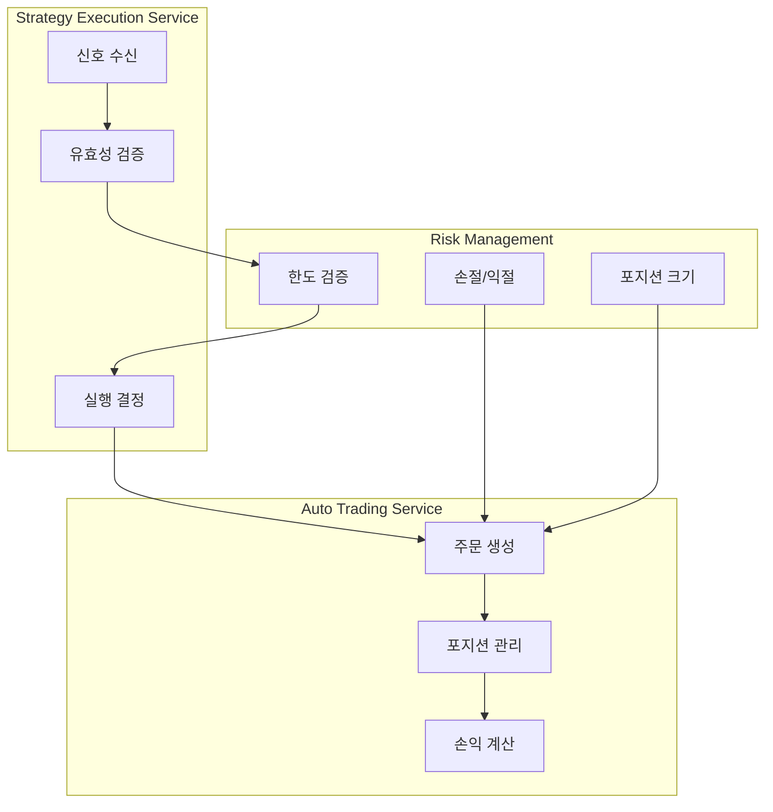
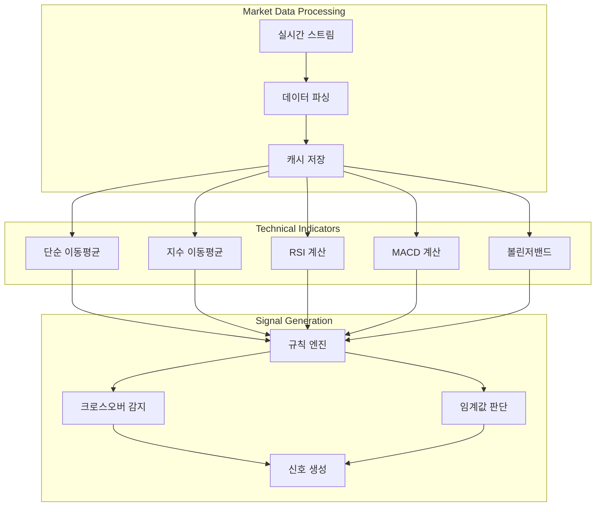
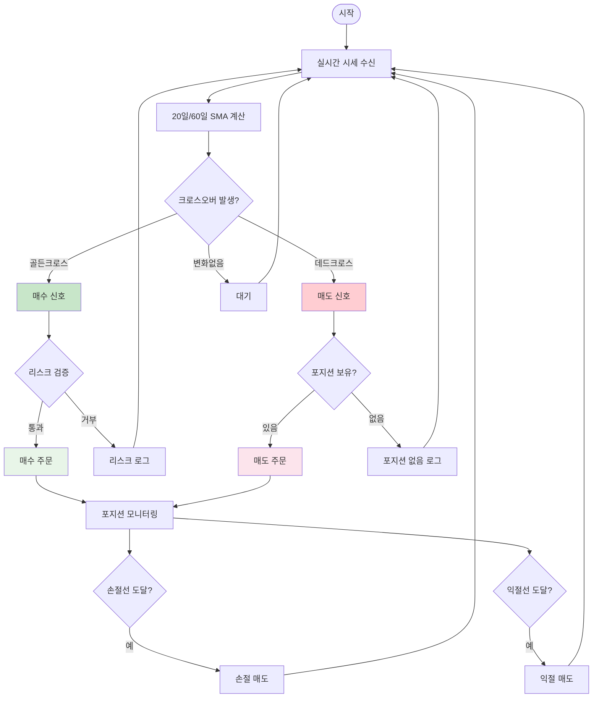
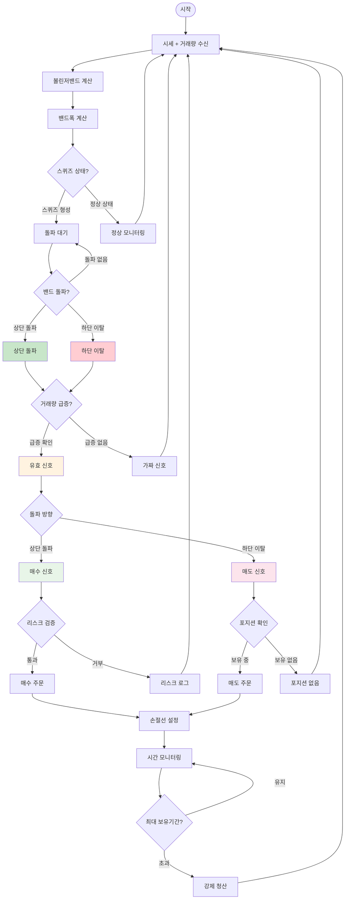
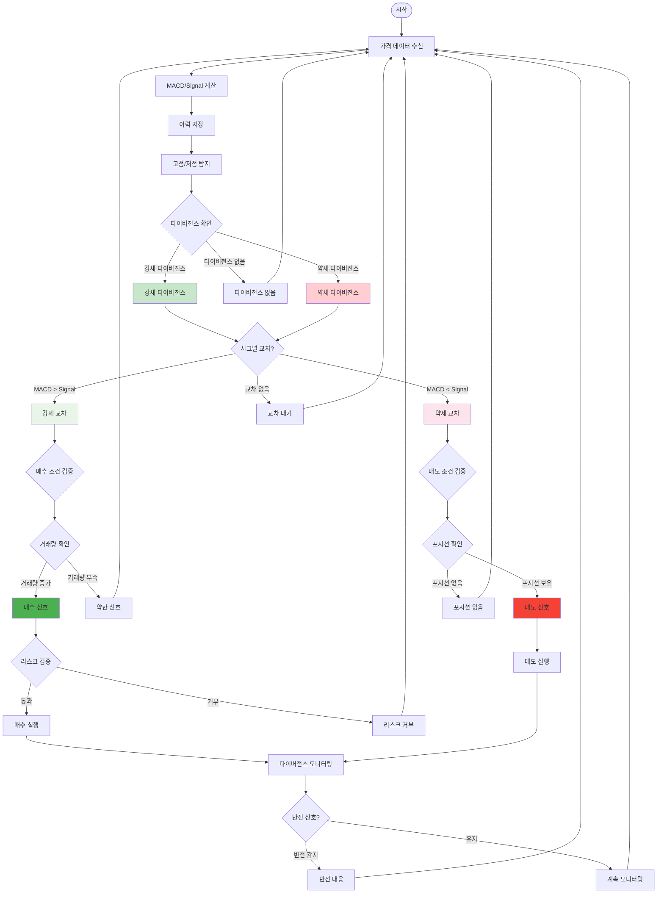
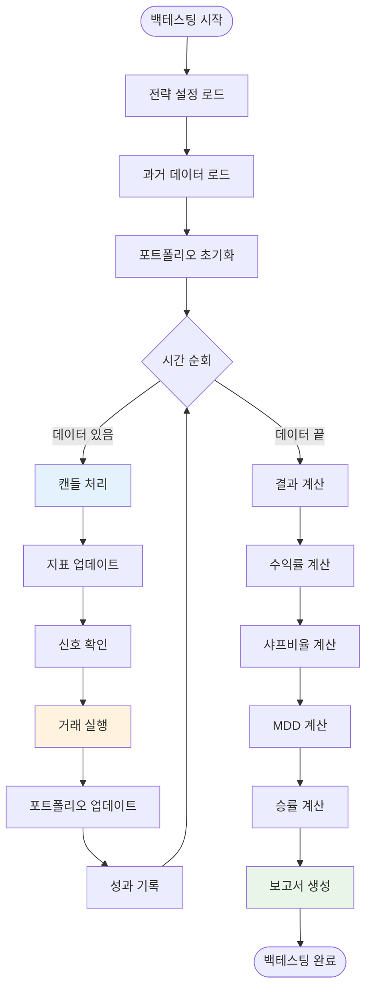
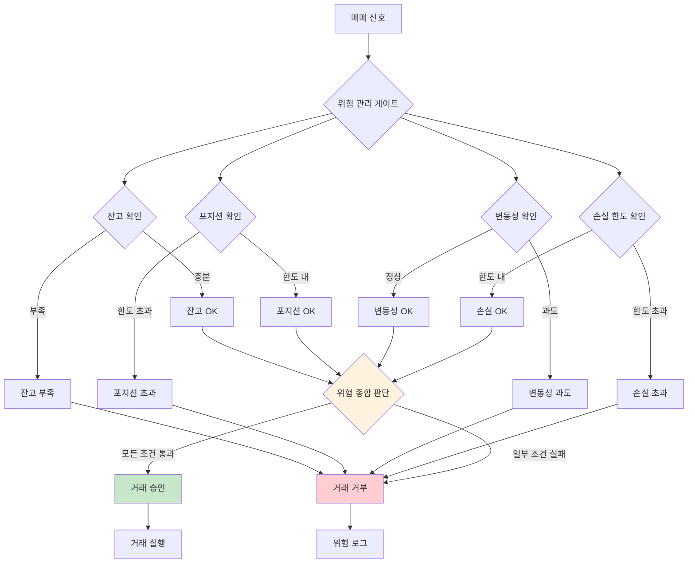

# 자동매매 전략 실행 시스템 흐름도

## 🏗️ 전체 시스템 아키텍처



## 📊 데이터 흐름 다이어그램



## 🔄 모듈별 상세 역할

### 1. Frontend Strategy Management



### 2. Java Backend Services



### 3. Python Analysis Engine



## 🎯 개별 전략 실행 흐름

### 전략 1: 이동평균 크로스오버



### 전략 2: RSI 역추세 전략

```mermaid
flowchart TD
    Start([시작]) --> GetPrice[실시간 가격 수신]
    GetPrice --> CalcRSI[RSI(14) 계산]
    CalcRSI --> CheckRSI{RSI 상태 확인}
    
    CheckRSI -->|RSI ≤ 30| Oversold[과매도 구간]
    CheckRSI -->|RSI ≥ 70| Overbought[과매수 구간]
    CheckRSI -->|30 < RSI < 70| Neutral[중립 구간]
    
    Oversold --> CheckBuyCondition{매수 조건 확인}
    Overbought --> CheckSellCondition{매도 조건 확인}
    Neutral --> CheckNeutralExit{중립선 청산?}
    
    CheckBuyCondition -->|조건 만족| BuySignal[매수 신호]
    CheckBuyCondition -->|조건 불만족| Wait[대기]
    
    CheckSellCondition -->|포지션 있음| SellSignal[매도 신호]
    CheckSellCondition -->|포지션 없음| Wait
    
    CheckNeutralExit -->|설정 활성화| NeutralExit[중립선 청산]
    CheckNeutralExit -->|설정 비활성화| Wait
    
    BuySignal --> ValidateRisk{리스크 검증}
    SellSignal --> PlaceSellOrder[매도 주문]
    NeutralExit --> PlaceSellOrder
    
    ValidateRisk -->|통과| PlaceBuyOrder[매수 주문]
    ValidateRisk -->|거부| Wait
    
    PlaceBuyOrder --> MonitorPosition[포지션 모니터링]
    PlaceSellOrder --> MonitorPosition
    
    MonitorPosition --> GetPrice
    Wait --> GetPrice
    
    style Oversold fill:#c8e6c9
    style Overbought fill:#ffcdd2
    style BuySignal fill:#e8f5e8
    style SellSignal fill:#fce4ec
```

### 전략 3: 볼린저밴드 스퀴즈



### 전략 4: MACD 다이버전스



## 🔄 통합 백테스팅 흐름



## 🚨 위험 관리 체계



이 문서는 자동매매 전략 실행 시스템의 전체적인 구조와 각 모듈 간의 상호작용, 그리고 개별 전략별 세부 실행 흐름을 시각적으로 보여줍니다. 각 다이어그램은 실제 구현 시 참고할 수 있는 상세한 로직 흐름을 제공합니다.