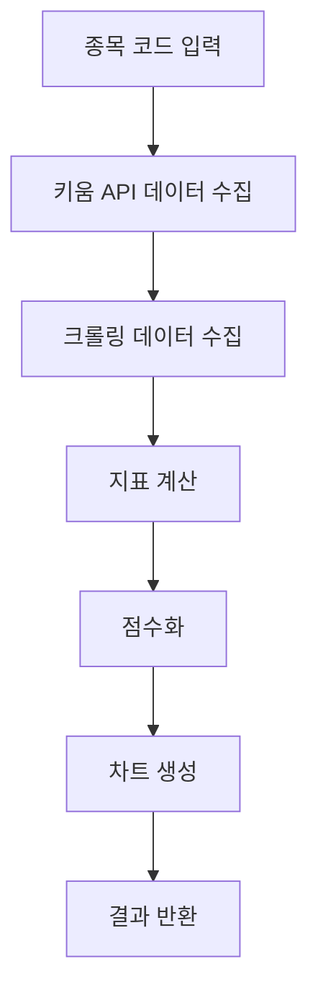

# Google Sheets 종목분석 시스템 → Python 구현 계획서

## 📊 Google Sheets 분석 시스템 분석 결과

### 🏗️ 시스템 구조
- **4개 시트**: 종목분석_자동, 종목분석_수동, 분석결과누적, 전종목기본정보
- **분석 대상**: 개별 종목 (현재 코나아이 052400 분석 확인)
- **자동화**: GOOGLEFINANCE(), 크롤링 함수, Apps Script 활용

### 🎯 4개 영역별 점수 체계 (총 14점)

#### 1. 재무 영역 (3점)
- **매출액**: 전년 대비 증가율
- **영업이익**: 전년 대비 증가율  
- **영업이익률**: 업종 평균 대비
- **부채비율**: 안전성 지표
- **유보율**: 배당 여력

#### 2. 기술 영역 (4점)
- **RSI**: 과매수/과매도 지표
- **OBV**: 거래량 기반 추세 지표
- **투자심리도**: 시장 심리 반영
- **이동평균선**: 추세 분석

#### 3. 가격 영역 (2점)
- **최고가 대비**: 현재 위치
- **최저가 대비**: 반등 정도
- **가격 모멘텀**: 상승/하락 추세

#### 4. 재료 영역 (5점)
- **배당률**: 배당 수익률
- **외국인 보유율**: 외국인 관심도
- **기관 순매매**: 60일 기준
- **거래량**: 평균 대비 활성도
- **이자보상배율**: 재무 안전성

### 🔢 점수화 방식
- **각 지표**: -1점 ~ +1점 범위
- **상대 평가**: 업종 평균, 경쟁사 대비
- **가중치**: 영역별 중요도 반영
- **총점 해석**: 
  - 10점 이상: 매수 고려
  - 5-10점: 관심 종목
  - 0-5점: 보통
  - 0점 미만: 주의 필요

## 🐍 Python 모듈 설계

### 📁 디렉토리 구조
```
src/kiwoom_api/analysis/
├── __init__.py
├── core/
│   ├── __init__.py
│   ├── calculator.py      # 지표 계산 엔진
│   ├── scorer.py          # 점수화 로직
│   └── models.py          # 데이터 모델
├── indicators/
│   ├── __init__.py
│   ├── financial.py       # 재무 지표 계산
│   ├── technical.py       # 기술적 지표 (RSI, OBV 등)
│   ├── price.py           # 가격 관련 지표
│   └── material.py        # 재료 분석
├── crawlers/
│   ├── __init__.py
│   ├── news_crawler.py    # 뉴스 크롤링
│   ├── disclosure_crawler.py  # 공시 크롤링
│   └── market_crawler.py  # 시장 데이터
├── charts/
│   ├── __init__.py
│   ├── generator.py       # 차트 생성
│   └── templates.py       # 차트 템플릿
└── api/
    ├── __init__.py
    └── analysis_router.py # FastAPI 엔드포인트
```

### 🔧 핵심 모듈 설계

#### 1. 지표 계산 엔진 (`calculator.py`)
```python
class IndicatorCalculator:
    def __init__(self, stock_code: str):
        self.stock_code = stock_code
        
    async def calculate_rsi(self, period: int = 14) -> float:
        """RSI 계산"""
        
    async def calculate_per(self) -> float:
        """PER 계산"""
        
    async def calculate_roe(self) -> float:
        """ROE 계산"""
        
    async def calculate_obv(self) -> float:
        """OBV 계산"""
```

#### 2. 점수화 시스템 (`scorer.py`)
```python
class AnalysisScorer:
    def score_rsi(self, rsi: float) -> float:
        """RSI를 -1~+1 점수로 변환"""
        if rsi <= 30:
            return 1.0  # 과매도 → 매수 기회
        elif rsi >= 70:
            return -1.0  # 과매수 → 매도 신호
        else:
            return (50 - rsi) / 20  # 선형 변환
            
    def score_financial(self, indicators: dict) -> float:
        """재무 지표 종합 점수"""
        
    def calculate_total_score(self, scores: dict) -> dict:
        """4개 영역 총점 계산"""
```

#### 3. 크롤링 모듈 (`crawlers/`)
```python
class NewsCrawler:
    async def get_stock_news(self, stock_code: str) -> List[dict]:
        """종목 관련 뉴스 크롤링"""
        
class DisclosureCrawler:
    async def get_disclosures(self, stock_code: str) -> List[dict]:
        """공시 정보 크롤링"""
        
class MarketCrawler:
    async def get_market_data(self, stock_code: str) -> dict:
        """시장 데이터 수집"""
```

#### 4. 차트 생성 (`charts/`)
```python
class ChartGenerator:
    def create_score_chart(self, scores: dict) -> str:
        """점수 레이더 차트 생성"""
        
    def create_trend_chart(self, data: List[dict]) -> str:
        """추세 차트 생성"""
        
    def create_comparison_chart(self, stocks: List[str]) -> str:
        """종목 비교 차트"""
```

## 🚀 단계별 구현 로드맵

### 1단계: RSI 계산 API ⭐ (최우선)
**목표**: 가장 간단한 기술적 지표 하나 구현
```
GET /api/analysis/rsi/{stock_code}
→ {"rsi": 65.2, "score": 0.3, "interpretation": "중립"}
```

**구현 범위**:
- RSI 계산 로직
- 키움 일봉 데이터 연동
- 점수화 (-1~+1)
- 웹 UI 연동

**소요 시간**: 1-2시간

### 2단계: 재무 지표 계산
**목표**: PER, ROE, 부채비율 등 기본 재무 지표

**구현 범위**:
- 재무제표 데이터 수집
- 재무 지표 계산 공식
- 업종 평균 대비 점수화

**소요 시간**: 2-3시간

### 3단계: 기술적 지표 확장
**목표**: OBV, 이동평균선, 투자심리도

**구현 범위**:
- 다양한 기술적 지표 구현
- 차트 패턴 분석
- 추세 분석 로직

**소요 시간**: 3-4시간

### 4단계: 크롤링 기능
**목표**: 뉴스, 공시, 외부 데이터 수집

**구현 범위**:
- 네이버/다음 뉴스 크롤링
- 공시 정보 수집
- 외국인/기관 매매 동향

**소요 시간**: 4-5시간

### 5단계: 차트 생성
**목표**: 분석 결과 시각화

**구현 범위**:
- 점수 레이더 차트
- 추세 분석 차트
- 종목 비교 차트

**소요 시간**: 2-3시간

### 6단계: 통합 분석 시스템
**목표**: 4개 영역 종합 분석

**구현 범위**:
- 전체 점수 계산
- 매수/매도 신호 생성
- 분석 리포트 자동 생성

**소요 시간**: 3-4시간

### 7단계: 다종목 분석
**목표**: 여러 종목 동시 분석

**구현 범위**:
- 배치 처리 시스템
- 랭킹 시스템
- 포트폴리오 분석

**소요 시간**: 4-5시간

## 🛠️ 기술 스택

### 📚 필요 라이브러리
```python
# 데이터 처리
pandas >= 1.5.0
numpy >= 1.24.0

# 기술적 지표 계산
TA-Lib >= 0.4.25
pandas-ta >= 0.3.14

# 크롤링
beautifulsoup4 >= 4.11.0
selenium >= 4.8.0
requests >= 2.28.0

# 차트 생성
matplotlib >= 3.6.0
plotly >= 5.13.0
seaborn >= 0.12.0

# 비동기 처리
aiohttp >= 3.8.0
asyncio-throttle >= 1.0.0

# 데이터 저장
sqlite3 (내장)
# 또는 PostgreSQL for production
```

### 🔌 FastAPI 연동

#### API 엔드포인트 설계
```python
# 개별 지표 분석
GET /api/analysis/rsi/{stock_code}
GET /api/analysis/per/{stock_code}  
GET /api/analysis/roe/{stock_code}

# 영역별 분석
GET /api/analysis/financial/{stock_code}
GET /api/analysis/technical/{stock_code}
GET /api/analysis/price/{stock_code}
GET /api/analysis/material/{stock_code}

# 종합 분석
GET /api/analysis/total/{stock_code}
POST /api/analysis/multiple
# Body: {"stocks": ["005930", "000660"]}

# 차트 생성
GET /api/analysis/chart/{stock_code}/{chart_type}

# 크롤링 데이터
GET /api/analysis/news/{stock_code}
GET /api/analysis/disclosure/{stock_code}
```

#### 웹 UI 연동
```javascript
// 분석 요청
async function analyzeStock(stockCode) {
    const response = await fetch(`/api/analysis/total/${stockCode}`);
    const data = await response.json();
    
    // 결과 표시
    updateAnalysisCard(data);
}

// 차트 표시
async function showChart(stockCode, chartType) {
    const chartUrl = `/api/analysis/chart/${stockCode}/${chartType}`;
    document.getElementById('chart').innerHTML = 
        ``;
}
```

## 📈 데이터 흐름

### 분석 프로세스


### 데이터 소스
1. **키움 API**: 주가, 거래량, 재무 데이터
2. **외부 크롤링**: 뉴스, 공시, 시장 데이터
3. **계산 결과**: RSI, PER, ROE 등 지표
4. **점수화**: Google Sheets 로직 적용

## 🎯 성공 지표

### 1단계 성공 기준
- [ ] RSI API 응답 시간 < 2초
- [ ] 계산 정확도 검증
- [ ] 웹 UI에서 정상 표시

### 최종 성공 기준  
- [ ] 4개 영역 모든 지표 계산
- [ ] Google Sheets와 동일한 점수
- [ ] 다종목 동시 분석 지원
- [ ] 차트 시각화 완성
- [ ] 매수/매도 신호 생성

## 📝 개발 우선순위

**🔥 즉시 시작**: RSI 계산 API
**⚡ 다음 단계**: 재무 지표 (PER, ROE)
**📊 중기 목표**: 크롤링 + 차트
**🎯 최종 목표**: 통합 분석 시스템

---

*이 계획서는 Google Sheets의 종목분석 시스템을 Python으로 단계적으로 구현하기 위한 로드맵입니다. 각 단계별로 작은 기능부터 완성해 나가며, 최종적으로는 실시간 종목 분석 시스템을 완성하는 것이 목표입니다.*