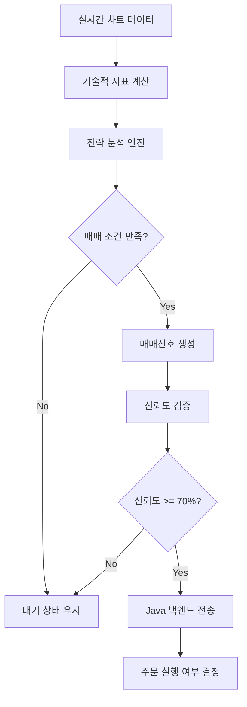

# 🤖 Python 자동매매 전략 시스템 구현 계획

## 📋 프로젝트 개요

**목표**: 키움증권 API를 활용한 실시간 자동매매 전략 시스템 구축
**위치**: `quantum-adapters/kiwoom-adapter/src/kiwoom_api/strategy/`
**기술스택**: Python 3.11, FastAPI, pandas, ta-lib, APScheduler

## 🏗️ 아키텍처 설계

### 전략 시스템 구조
```
strategy/
├── models/                     # 데이터 모델
│   ├── trading_signal.py      # ✅ 완료 - 매매신호 모델 
│   └── strategy_config.py     # ✅ 완료 - 전략설정 모델
├── indicators/                 # 기술적 지표
│   ├── technical_indicators.py # RSI, MACD, 볼린저밴드 등
│   └── moving_average.py      # 이동평균 계산
├── engines/                    # 전략 엔진
│   ├── base_strategy.py       # 추상 전략 기본 클래스
│   └── moving_average_crossover.py # 이평선 교차 전략
└── runners/                    # 실행 관리
    ├── strategy_runner.py     # 전략 실시간 실행기
    └── scheduler_manager.py   # APScheduler 관리
```

## 🎯 구현 단계별 계획

### Phase 1: 핵심 컴포넌트 구현
1. **BaseStrategy 추상 클래스** (`engines/base_strategy.py`)
   ```python
   class BaseStrategy(ABC):
       @abstractmethod
       async def analyze(self, symbol: str) -> TradingSignal
       @abstractmethod  
       async def should_buy(self, data: pd.DataFrame) -> bool
       @abstractmethod
       async def should_sell(self, data: pd.DataFrame) -> bool
   ```

2. **기술적 지표 모듈** (`indicators/technical_indicators.py`)
   - RSI (Relative Strength Index)
   - MACD (Moving Average Convergence Divergence) 
   - 볼린저 밴드 (Bollinger Bands)
   - 이동평균선 (Simple/Exponential Moving Average)

3. **이동평균 교차 전략** (`engines/moving_average_crossover.py`)
   - 단기 이평선(5일) > 장기 이평선(20일) → 매수 신호
   - 단기 이평선(5일) < 장기 이평선(20일) → 매도 신호
   - RSI 보조 지표로 과매수/과매도 필터링

### Phase 2: 실시간 실행 시스템
4. **StrategyRunner** (`runners/strategy_runner.py`)
   ```python
   class StrategyRunner:
       async def start_strategy(self, config: StrategyConfig)
       async def stop_strategy(self, strategy_name: str) 
       async def get_active_signals(self) -> List[TradingSignal]
   ```

5. **스케줄러 관리자** (`runners/scheduler_manager.py`)
   - APScheduler 기반 주기적 전략 실행 (30초~5분 간격)
   - 실시간 차트 데이터 수집 및 분석
   - 매매 신호 생성 및 전송

### Phase 3: API 통합
6. **전략 실행 API 엔드포인트** (`api/strategy.py`)
   ```python
   POST /api/strategy/start     # 전략 시작
   POST /api/strategy/stop      # 전략 중지  
   GET  /api/strategy/signals   # 현재 매매신호 조회
   GET  /api/strategy/status    # 전략 실행 상태
   ```

7. **Java 백엔드 연동** (quantum-web-api)
   ```java
   @RestController
   public class TradingSignalController {
       @PostMapping("/trading/signals/receive")  
       public ResponseEntity<Void> receiveSignal(@RequestBody TradingSignalDto signal)
   }
   ```

## 📊 매매 신호 처리 플로우



## 🛡️ 리스크 관리 시스템

### 1. 포지션 관리
- **최대 동시 포지션**: 5개 종목
- **포지션 크기**: 총 자본의 10% 이하
- **손절매**: -5% 도달 시 자동 청산
- **익절매**: +10% 도달 시 자동 청산

### 2. 신호 필터링
```python
class SignalValidator:
    def validate_signal(self, signal: TradingSignal) -> bool:
        return (
            signal.confidence >= 0.7 and        # 70% 이상 신뢰도
            signal.is_valid() and               # 유효기간 내 신호
            self.check_risk_limits() and        # 리스크 한도 확인
            self.check_market_hours()           # 장중 시간 확인  
        )
```

### 3. 백테스팅 시스템
- 과거 1년간 데이터로 전략 성과 검증
- 샤프 비율, 최대 낙폭(MDD) 계산
- 승률, 평균 수익률 분석

## 🔧 개발 환경 설정

### 필수 의존성 (이미 추가됨)
```toml
pandas = "^2.0.0"        # 데이터 처리
numpy = "^1.24.0"        # 수치 계산  
ta = "^0.10.2"          # 기술적 지표
apscheduler = "^3.10.4"  # 스케줄링
```

### 실행 환경
- **개발**: `KIWOOM_SANDBOX_MODE=true` (모의투자)
- **운영**: `KIWOOM_SANDBOX_MODE=false` (실제투자)
- **모니터링**: Prometheus 메트릭 + Grafana 대시보드

## 📈 테스트 전략

### 1. 단위 테스트
```python
# tests/test_moving_average_strategy.py
def test_moving_average_crossover():
    strategy = MovingAverageCrossoverStrategy(config)
    signal = await strategy.analyze("005930")  # 삼성전자
    assert signal.signal_type == SignalType.BUY
```

### 2. 통합 테스트  
```python
# tests/test_strategy_integration.py  
def test_end_to_end_trading():
    runner = StrategyRunner()
    await runner.start_strategy(config)
    signals = await runner.get_active_signals()
    assert len(signals) > 0
```

### 3. 모의투자 검증
- 샌드박스 환경에서 실제 API 호출 테스트
- 매매신호 생성부터 주문 실행까지 전 과정 검증

## 🚀 배포 및 운영

### Docker 통합
```dockerfile
# 키움 어댑터 컨테이너에 전략 엔진 포함
RUN pip install pandas numpy ta apscheduler
COPY src/kiwoom_api/strategy/ /app/strategy/
```

### 모니터링 메트릭
- 전략별 매매신호 생성 횟수
- 신호 정확도 (승률) 추적  
- 실행 지연시간 모니터링
- 오류 발생률 알림

## 📝 다음 단계

1. **즉시 시작 가능**: BaseStrategy 추상 클래스 구현
2. **2단계**: 기술적 지표 모듈 개발 
3. **3단계**: MovingAverageCrossover 전략 구현
4. **4단계**: 실시간 실행기 및 스케줄러 구축
5. **최종**: Java 백엔드와 API 통합

---

**⚠️ 중요 고려사항**
- 실제 투자 전 충분한 백테스팅 및 모의투자 검증 필수
- 리스크 관리 시스템 우선 구현 후 전략 추가
- 키움증권 API 호출 한도 및 제약사항 준수
- 금융투자업법 및 관련 규정 준수