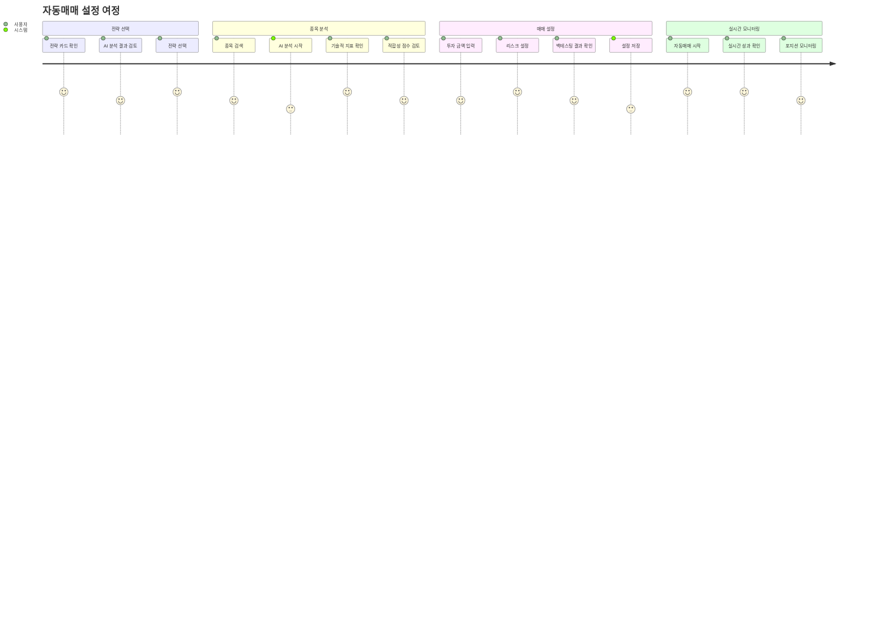
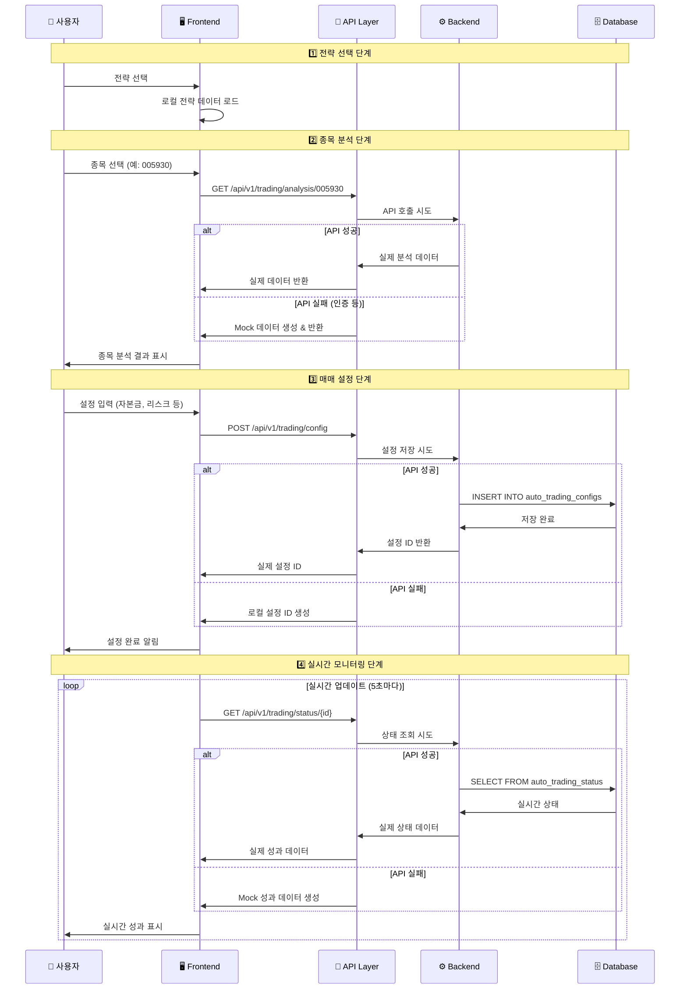
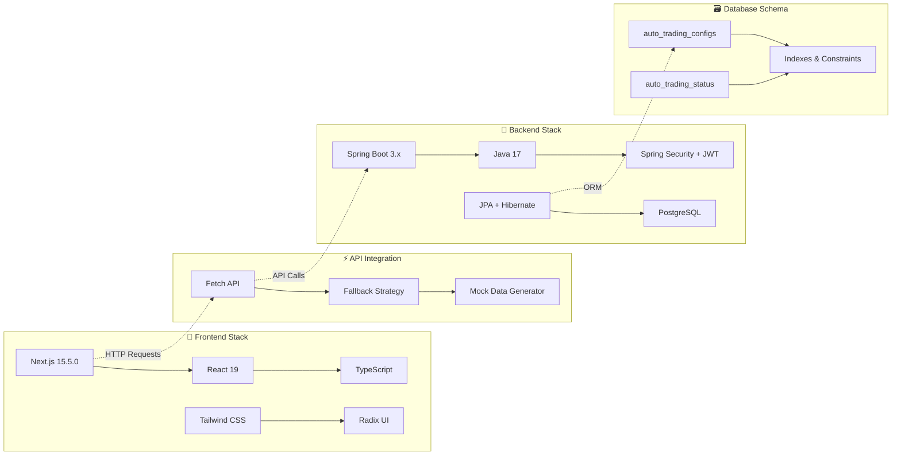
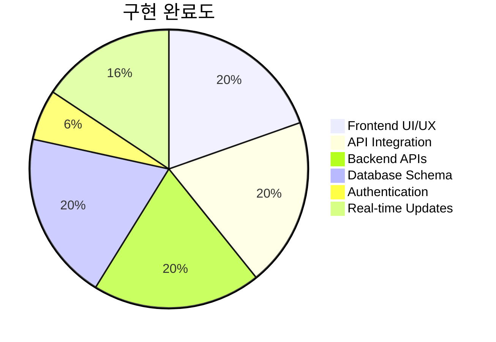

# 🤖 자동매매 시스템 플로우 다이어그램

## 전체 시스템 아키텍처

```mermaid
graph TB
    subgraph "🖥️ Frontend (Next.js)"
        A[사용자] --> B[자동매매 페이지<br/>localhost:10301/auto-trading]
        B --> C[4단계 마법사]
        
        subgraph "📋 4단계 플로우"
            C1[1️⃣ 전략 선택<br/>StrategySelector]
            C2[2️⃣ 종목 분석<br/>StockSelector] 
            C3[3️⃣ 매매 설정<br/>TradingConfigurer]
            C4[4️⃣ 실시간 모니터링<br/>TradingMonitor]
            
            C1 --> C2 --> C3 --> C4
        end
        
        C --> C1
    end
    
    subgraph "🔄 API 연동 레이어"
        D[API 호출 시도]
        E[실패시 Mock 데이터 폴백]
        F[성공시 실제 데이터 사용]
    end
    
    subgraph "⚙️ Backend (Spring Boot)"
        G[자동매매 API<br/>100.68.90.21:10101]
        
        subgraph "📊 API 엔드포인트"
            G1[/api/v1/trading/config<br/>설정 관리]
            G2[/api/v1/trading/analysis/{symbol}<br/>종목 분석]
            G3[/api/v1/trading/status/{id}<br/>상태 조회]
            G4[/api/v1/trading/config/{id}/start<br/>자동매매 제어]
        end
        
        G --> G1
        G --> G2  
        G --> G3
        G --> G4
    end
    
    subgraph "🗄️ Database (PostgreSQL)"
        H[(auto_trading_configs<br/>자동매매 설정)]
        I[(auto_trading_status<br/>실행 상태)]
    end
    
    C2 -.->|종목 분석 요청| D
    C3 -.->|설정 저장 요청| D
    C4 -.->|상태 조회 요청| D
    
    D --> E
    D --> F
    E -.->|Mock Response| C2
    E -.->|Mock Response| C3
    E -.->|Mock Response| C4
    F --> G
    G --> G2 --> C2
    G --> G1 --> C3
    G --> G3 --> C4
    
    G1 --> H
    G3 --> I
    G4 --> I
```

## 사용자 여정 (User Journey)



## 데이터 플로우



## 기술 스택 구조



## 현재 구현 상태



## 핵심 특징

### 🔄 **Fallback Strategy (폴백 전략)**
```
실제 API 호출 시도
        ↓
    연결 실패 감지
        ↓
    Mock 데이터 자동 생성
        ↓  
    사용자 경험 중단 없음
```

### 🎯 **Progressive Enhancement (점진적 개선)**
```
기본 기능 (Mock) → 실제 API → 실시간 연동 → 고급 기능
     ✅              ✅           🔄            🔮
```

### 📊 **Real-time Simulation (실시간 시뮬레이션)**
```
5초마다 데이터 갱신
    ↓
랜덤 성과 데이터 생성  
    ↓
차트 및 지표 업데이트
    ↓
실제 트레이딩 경험 제공
```